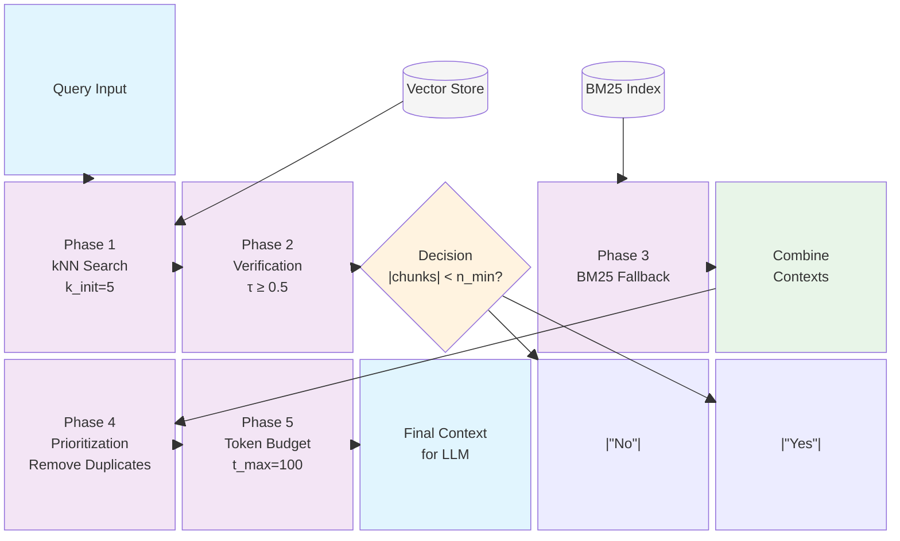

# MEVE Framework

Simple 5-phase pipeline for efficient context retrieval in RAG systems.

## Simple Flow

```
Query → kNN Search → Verify → [Fallback?] → Prioritize → Budget → Result
```

## Block Diagram



## How It Works

1. **Phase 1 - kNN Search**: Find similar chunks using vector search
2. **Phase 2 - Verify**: Check if chunks are actually relevant  
3. **Phase 3 - Fallback**: If not enough good chunks, try BM25 search
4. **Phase 4 - Prioritize**: Remove duplicates, rank by importance
5. **Phase 5 - Budget**: Pack best chunks within token limit

## Key Settings

```python
k_init = 5          # How many chunks to find initially
tau_relevance = 0.5 # Minimum relevance score to keep
n_min = 3           # Minimum chunks needed (triggers fallback if less)
t_max = 100         # Maximum tokens allowed
```

## Quick Example

```python
# Setup
engine = MeVeEngine(config, vector_store, bm25_index)

# Ask question
result = engine.run("What is the Eiffel Tower?")

# Get optimized context for LLM
print(result)
```

## What Makes It Smart

- **Quality First**: Only keeps relevant chunks
- **Backup Plan**: Falls back to BM25 if vector search fails
- **No Duplicates**: Removes redundant information  
- **Budget Aware**: Fits within token limits
- **Fast**: Efficient pipeline design

## Usage

```python
from meve_engine import MeVeEngine, setup_simulation_data
from meve_data import MeVeConfig

# Setup
vector_store, bm25_index = setup_simulation_data()
config = MeVeConfig(k_init=5, tau_relevance=0.5, n_min=3, theta_redundancy=0.85, t_max=100)

# Initialize engine
engine = MeVeEngine(config, vector_store, bm25_index)

# Run query
result = engine.run("Your query here")
```
